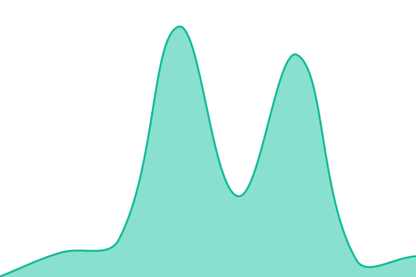

# [📈 Live Status](https://DontPanicAgency.github.io/upptime): <!--live status--> **🟧 Partial outage**

This repository contains the open-source uptime monitor and status page for [Don't Panic!](https://dontpanic.agency), powered by [Upptime](https://github.com/upptime/upptime).

With [Upptime](https://upptime.js.org), you can get your own unlimited and free uptime monitor and status page, powered entirely by a GitHub repository. We use [Issues](https://github.com/DontPanicAgency/upptime/issues) as incident reports, [Actions](https://github.com/DontPanicAgency/upptime/actions) as uptime monitors, and [Pages](https://DontPanicAgency.github.io/upptime) for the status page.

<!--start: status pages-->
<!-- This summary is generated by Upptime (https://github.com/upptime/upptime) -->
<!-- Do not edit this manually, your changes will be overwritten -->
<!-- prettier-ignore -->
| URL | Status | History | Response Time | Uptime |
| --- | ------ | ------- | ------------- | ------ |
|  [DP - dontpanic.agency](https://dontpanic.agency) | 🟩 Up | [dp-dontpanic-agency.yml](https://github.com/DontPanicAgency/upptime/commits/HEAD/history/dp-dontpanic-agency.yml) | 

 632ms
     
 | 

<a href="https://DontPanicAgency.github.io/upptime/history/dp-dontpanic-agency">100.00%</a>
    

|  [VVV - teamvvv.com](https://www.teamvvv.com/?monitor_check=true) | 🟩 Up | [vvv-teamvvv-com.yml](https://github.com/DontPanicAgency/upptime/commits/HEAD/history/vvv-teamvvv-com.yml) | 

 1527ms
     
 | 

<a href="https://DontPanicAgency.github.io/upptime/history/vvv-teamvvv-com">100.00%</a>
    

|  [GLA - gl-assessment.co.uk](https://www.gl-assessment.co.uk/) | 🟩 Up | [gla-gl-assessment-co-uk.yml](https://github.com/DontPanicAgency/upptime/commits/HEAD/history/gla-gl-assessment-co-uk.yml) | 

 296ms
     
 | 

<a href="https://DontPanicAgency.github.io/upptime/history/gla-gl-assessment-co-uk">100.00%</a>
    

|  [GLA - gl-education.com](https://www.gl-education.com/) | 🟩 Up | [gla-gl-education-com.yml](https://github.com/DontPanicAgency/upptime/commits/HEAD/history/gla-gl-education-com.yml) | 

 255ms
     
 | 

<a href="https://DontPanicAgency.github.io/upptime/history/gla-gl-education-com">100.00%</a>
    

|  [GLA - support.gl-assessment.co.uk](https://support.gl-assessment.co.uk/) | 🟩 Up | [gla-support-gl-assessment-co-uk.yml](https://github.com/DontPanicAgency/upptime/commits/HEAD/history/gla-support-gl-assessment-co-uk.yml) | 

 636ms
     
 | 

<a href="https://DontPanicAgency.github.io/upptime/history/gla-support-gl-assessment-co-uk">100.00%</a>
    

|  [CIR/Kent - virtualexperience.kent.ac.uk](https://virtualexperience.kent.ac.uk/) | 🟩 Up | [cir-kent-virtualexperience-kent-ac-uk.yml](https://github.com/DontPanicAgency/upptime/commits/HEAD/history/cir-kent-virtualexperience-kent-ac-uk.yml) | 

 1146ms
     
 | 

<a href="https://DontPanicAgency.github.io/upptime/history/cir-kent-virtualexperience-kent-ac-uk">100.00%</a>
    

|  [BUT - buttonschildrensparties.co.uk](https://buttonschildrensparties.co.uk/) | 🟩 Up | [but-buttonschildrensparties-co-uk.yml](https://github.com/DontPanicAgency/upptime/commits/HEAD/history/but-buttonschildrensparties-co-uk.yml) | 

 593ms
     
 | 

<a href="https://DontPanicAgency.github.io/upptime/history/but-buttonschildrensparties-co-uk">100.00%</a>
    

|  [BUT - wonderwoodexplorers.co.uk](https://wonderwoodexplorers.co.uk/) | 🟩 Up | [but-wonderwoodexplorers-co-uk.yml](https://github.com/DontPanicAgency/upptime/commits/HEAD/history/but-wonderwoodexplorers-co-uk.yml) | 

 853ms
     
 | 

<a href="https://DontPanicAgency.github.io/upptime/history/but-wonderwoodexplorers-co-uk">100.00%</a>
    

|  [DGL - deborah-glover.co.uk](https://deborah-glover.co.uk/) | 🟩 Up | [dgl-deborah-glover-co-uk.yml](https://github.com/DontPanicAgency/upptime/commits/HEAD/history/dgl-deborah-glover-co-uk.yml) | 

 730ms
     
 | 

<a href="https://DontPanicAgency.github.io/upptime/history/dgl-deborah-glover-co-uk">100.00%</a>
    

|  [DGL - pcnr.co.uk](https://pcnr.co.uk/) | 🟩 Up | [dgl-pcnr-co-uk.yml](https://github.com/DontPanicAgency/upptime/commits/HEAD/history/dgl-pcnr-co-uk.yml) | 

 607ms
     
 | 

<a href="https://DontPanicAgency.github.io/upptime/history/dgl-pcnr-co-uk">100.00%</a>
    

|  [SL - laura-turner.co.uk](https://laura-turner.co.uk) | 🟩 Up | [sl-laura-turner-co-uk.yml](https://github.com/DontPanicAgency/upptime/commits/HEAD/history/sl-laura-turner-co-uk.yml) | 

 655ms
     
 | 

<a href="https://DontPanicAgency.github.io/upptime/history/sl-laura-turner-co-uk">100.00%</a>
    

|  [DP - zaphod.dev](https://zaphod.dev) | 🟥 Down | [dp-zaphod-dev.yml](https://github.com/DontPanicAgency/upptime/commits/HEAD/history/dp-zaphod-dev.yml) | 

 366ms
     
 | 

<a href="https://DontPanicAgency.github.io/upptime/history/dp-zaphod-dev">0.00%</a>
    

|  [ELS - e6.s6.dpdhost.co.uk](https://e6.s6.dpdhost.co.uk) | 🟩 Up | [els-e6-s6-dpdhost-co-uk.yml](https://github.com/DontPanicAgency/upptime/commits/HEAD/history/els-e6-s6-dpdhost-co-uk.yml) | 

 437ms
     
 | 

<a href="https://DontPanicAgency.github.io/upptime/history/els-e6-s6-dpdhost-co-uk">100.00%</a>
    

|  [STH - surreytotalhealth.co.uk](https://surreytotalhealth.co.uk/) | 🟩 Up | [sth-surreytotalhealth-co-uk.yml](https://github.com/DontPanicAgency/upptime/commits/HEAD/history/sth-surreytotalhealth-co-uk.yml) | 

 1289ms
     
 | 

<a href="https://DontPanicAgency.github.io/upptime/history/sth-surreytotalhealth-co-uk">100.00%</a>
    

|  [TGS - thegarageshefford.co.uk](https://thegarageshefford.co.uk/) | 🟩 Up | [tgs-thegarageshefford-co-uk.yml](https://github.com/DontPanicAgency/upptime/commits/HEAD/history/tgs-thegarageshefford-co-uk.yml) | 

 775ms
     
 | 

<a href="https://DontPanicAgency.github.io/upptime/history/tgs-thegarageshefford-co-uk">100.00%</a>
    

|  [WBG - waltonbridgegarage.co.uk](https://waltonbridgegarage.co.uk/) | 🟩 Up | [wbg-waltonbridgegarage-co-uk.yml](https://github.com/DontPanicAgency/upptime/commits/HEAD/history/wbg-waltonbridgegarage-co-uk.yml) | 

 793ms
     
 | 

<a href="https://DontPanicAgency.github.io/upptime/history/wbg-waltonbridgegarage-co-uk">100.00%</a>
    

|  [WRI - wrightwell.co.uk](https://waltonbridgegarage.co.uk/wp-content/themes/waltonbridge/favicon.ico?time=1735901938) | 🟩 Up | [wri-wrightwell-co-uk.yml](https://github.com/DontPanicAgency/upptime/commits/HEAD/history/wri-wrightwell-co-uk.yml) | 

 263ms
     
 | 

<a href="https://DontPanicAgency.github.io/upptime/history/wri-wrightwell-co-uk">100.00%</a>
    

|  [WRI - whentheygetolder.co.uk](https://whentheygetolder.co.uk/) | 🟩 Up | [wri-whentheygetolder-co-uk.yml](https://github.com/DontPanicAgency/upptime/commits/HEAD/history/wri-whentheygetolder-co-uk.yml) | 

 924ms
     
 | 

<a href="https://DontPanicAgency.github.io/upptime/history/wri-whentheygetolder-co-uk">100.00%</a>
    

<!--end: status pages-->

[**Visit our status website →**](https://DontPanicAgency.github.io/upptime)

## 📄 License

- Powered by: [Upptime](https://github.com/upptime/upptime)
- Code: [MIT](./LICENSE) © [Anand Chowdhary](https://anandchowdhary.com), supported by [Pabio](https://pabio.com)
- Data in the `./history` directory: [Open Database License](https://opendatacommons.org/licenses/odbl/1-0/)
